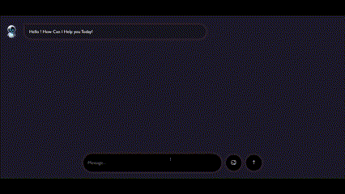

# ChatBot-Using-HTML-CSS-JS-Mini-Project
---

# AI Chatbot Interface

Welcome to the **AI Chatbot Interface**! This project is a simple yet powerful chatbot that interacts with users using text and image inputs. It integrates AI-powered responses and provides a smooth, dynamic user experience.

---

## 🚀 Features

- **AI-Powered Responses**: Communicates with an AI model to generate meaningful replies.
- **Interactive Chat UI**: A user-friendly interface for seamless conversations.
- **Image Upload Support**: Users can upload images, which are processed and displayed in the chat.
- **Smooth Scrolling & Animation**: Ensures a visually appealing chat experience.
- **Auto-Response Mechanism**: AI bot replies automatically with appropriate messages.

---

## 🛠️ Technologies Used

- **HTML, CSS, JavaScript**: For building the frontend interface.
- **Google Gemini API**: AI-powered text generation.
- **FileReader API**: Converts images into base64 format for processing.
- **Fetch API**: Handles API requests asynchronously.

---

## 📂 Project Structure

```
📁 AI-Chatbot-Interface
│── 📄 index.html      # Main HTML structure
│── 📄 style.css       # Styling for the chatbot UI
│── 📄 script.js       # JavaScript logic for chat interactions
│── 📁 images/         # Folder containing UI images
└── 📄 README.md       # Project documentation
```

---

## 🛠️ Setup & Installation

1. **Clone the Repository**:
   ```sh
   git clone https://github.com/Vison-art/ChatBot-Using-HTML-CSS-JS-Mini-Project.git
   ```
2. **Navigate to the Project Folder**:
   ```sh
   cd ChatBot-Using-HTML-CSS-JS-Mini-Project
   ```
3. **Open `index.html` in Your Browser**

That's it! Your AI Chatbot Interface is ready to use. 🚀

---

## 📌 Usage Guide

- **Enter a message** in the input field and press `Enter` or click the `Submit` button.
- **Upload an image** by clicking the `Image Upload` button and selecting a file.
- **AI will respond** with relevant text and image previews if applicable.
- **Enjoy chatting!**

---

## 📸 Screenshots

📷 

---

## 🛠️ API Configuration

To use this chatbot, ensure you replace the placeholder API key in `script.js` with your own Google Gemini API key:

```javascript
const APi_Url = "https://generativelanguage.googleapis.com/v1beta/models/gemini-1.5-flash:generateContent?key=YOUR_API_KEY";
```

---

## 🤝 Contributing

Contributions are welcome! If you’d like to improve the chatbot, follow these steps:

1. **Fork the repository**
2. **Create a new branch**: `git checkout -b feature-branch`
3. **Make changes and commit**: `git commit -m 'Added new feature'`
4. **Push to the branch**: `git push origin feature-branch`
5. **Submit a Pull Request**

---

## 📜 License

This project is licensed under the MIT License. Feel free to use and modify it as needed.

---

## 🌟 Acknowledgments

- Inspired by modern chatbot UIs
- Google Gemini API for AI responses
- Open-source community for continuous improvement

📌 **Star this repo if you find it useful! ⭐**


